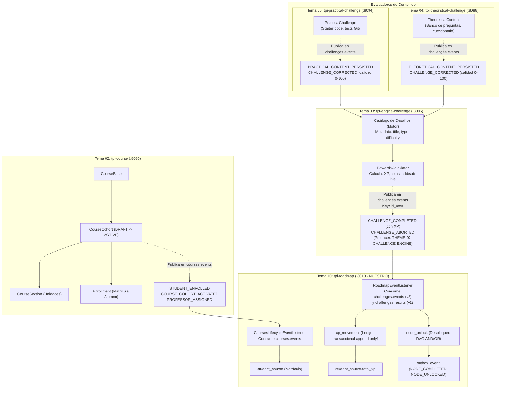

# Investigación Técnica: Cursos, Desafíos y Progreso con XP (Mock Stack)

- **Fecha:** 3 de octubre de 2026
- **Autor / Dispatched Worker:** `task_c345b108d430` / `term_a9e2062e-e2a6-41cb-91c6-b05b042f6c4f`
- **Contexto:** Plataforma LMS / Gamificación TPI 2026 (UTN-FRC). Construcción del **Mock Stack dockerizado** (Grupo 10 - `tpi-roadmap`) para pruebas integradas del frontend y el motor de progreso.
- **Microservicios Analizados:**
  - `Backend/_integracion/tpi-course` (Tema 02 — Cursos y Matrícula)
  - `Backend/_integracion/tpi-practical-challenge` (Tema 05 — Desafíos Prácticos)
  - `Backend/_integracion/tpi-theoristcal-challenge` (Tema 04 — Desafíos Teóricos)
  - `Backend/_integracion/tpi-engine-challenge` y `Backend/_integracion-develop/tpi-engine-challenge` (Tema 03 — Motor de Desafíos)
  - `Backend/tpi-roadmap` (Tema 10 — Roadmap, Progreso y XP Ledger — NUESTRO)
  - `Frontend/2026-PIV-TPI-FE` (Frontend Angular de referencia)

---

## 1. Resumen Ejecutivo y Arquitectura de Integración

Para habilitar un entorno de pruebas autocontenido (**Mock Stack**) que permita al frontend y a `tpi-roadmap` validar flujos punta a punta (creación de cursos, cohortes, secciones, contenidos/desafíos, mapeo a nodos del grafo de aprendizaje, y simulación de desafíos completados/fallados con impacto de XP y desbloqueo progresivo), es fundamental desentrañar las fronteras de responsabilidad entre microservicios:



### Hallazgos Clave de la Investigación
1. **Separación Estricta de XP y Ciclo de Vida:** Ni `tpi-course`, ni `tpi-practical-challenge`, ni `tpi-theoristcal-challenge` calculan ni persisten XP, monedas ni vidas. La XP Base tampoco se guarda dentro del desafío: proviene de parámetros institucionales centralizados en Backoffice (PAR-01: `EASY`=100, `MEDIUM`=250, `HARD`=500). El cálculo y despacho de XP es **responsabilidad exclusiva del Motor de Desafíos (`engine-challenge-service`)**.
2. **Estado del Repositorio de Motor (`tpi-engine-challenge`):** En `Backend/_integracion/tpi-engine-challenge` (rama `main`) solo existe un andamiaje vacío (scaffold). La implementación real completa de negocio (con `AttemptController`, `ChallengeController`, `RewardsCalculator`, outbox de eventos y listeners) se encuentra en `Backend/_integracion-develop/tpi-engine-challenge` (rama `develop` con más de 63 PRs).
3. **Eventos Publicados por Courses:** `tpi-course` publica en `courses.events` únicamente 3 eventos: `COURSE_COHORT_ACTIVATED`, `PROFESSOR_ASSIGNED` y `STUDENT_ENROLLED`. **No emite ningún evento Kafka al crear secciones, contenidos ni actividades.**
4. **Acuerdo Contractual v3 de Cierre de Desafío:** El Motor y `tpi-roadmap` tienen implementado el contrato de cierre v3 unificado en el tópico `challenges.events`, con sobre de 6 campos (`event_id`, `event_type`, `eventVersion: 1`, `timestamp`, `producer: "THEME-02-CHALLENGE-ENGINE"`, `payload`) y payload con estructura idéntica (`resources`, `result`, `id_user`, `id_course`, `id_node`, `challenge_id`).

---

## 2. Microservicio `tpi-course` (Tema 02 - Cursos y Matrícula)

### 2.1 Identidad, Puertos, Eureka y Exposición

| Propiedad | Valor Canónico | Cita en Código |
|---|---|---|
| **Service ID (Eureka)** | `course-service` | `tpi-course/src/main/resources/application.properties:27`, `tpi-integration.yml:1` |
| **Segmento Gateway** | `course` (Ruta: `/api/course/**`) | `tpi-course/tpi-integration.yml:2`, `application.properties:53` |
| **Prefijo Privado** | `/api/course` | `tpi-course/src/main/resources/application.properties:53` |
| **Prefijo Público** | `/api/course/public` | `tpi-course/src/main/resources/application.properties:52` |
| **Puerto HTTP (`server.port`)** | `8086` | `tpi-course/src/main/resources/application.properties:28` |
| **Puerto Management Actuator** | `8087` | `tpi-course/src/main/resources/application.properties:31` |
| **Base de Datos** | PostgreSQL (puerto compose `5435`, db `tpi_course`, user `tpi_course`) | `tpi-course/.compose/docker-compose.yml:11` |
| **Tópico Publicación Kafka** | `courses.events` (`app.kafka.course-events-topic`) | `tpi-course/src/main/resources/application.properties:76` |
| **Consumer Group Kafka** | `tema-02-course-group` | `tpi-course/src/main/resources/application.properties:77` |

---

### 2.2 Modelo de Datos Completo

El esquema de `tpi-course` está definido en JPA y gestionado por Flyway (`src/main/resources/db/migration/V1__create_lms_schema.sql` a `V12`):

#### 1. `Institution` (`ar.edu.utn.frc.tup.p4.entities.Institution`)
- `id` (`UUID`, PK)
- `name` (`VARCHAR(200)`, NOT NULL)
- `description` (`VARCHAR(1000)`)
- `created_datetime`, `last_updated_datetime` (`TIMESTAMP`, NOT NULL)
- `is_active` (`BOOLEAN`, NOT NULL, default `true`)

#### 2. `CourseBase` (`ar.edu.utn.frc.tup.p4.entities.CourseBase:34-70`)
Representa la materia o programa académico reutilizable.
- `id` (`UUID`, PK)
- `institution_id` (`UUID`, FK `institution.id`, NOT NULL)
- `name` (`VARCHAR(200)`, NOT NULL) — Ej: "Programación IV"
- `description` (`VARCHAR(1000)`)
- `is_active` (`BOOLEAN`, NOT NULL, default `true`)
- `created_datetime`, `last_updated_datetime` (`TIMESTAMP`, NOT NULL)
- `created_user`, `last_updated_user` (`UUID`)

#### 3. `CourseCohort` (`ar.edu.utn.frc.tup.p4.entities.CourseCohort:54-110`)
Representa la comisión o período de cursado específico de un `CourseBase`.
- `id` (`UUID`, PK)
- `course_base_id` (`UUID`, FK `course_base.id`, NOT NULL)
- `course_cohort_origin_id` (`UUID`, FK `course_cohort.id`, nullable) — cohorte clonada
- `invitation_code` (`VARCHAR(50)`, UNIQUE) — código alfanumérico generado al activar (`ACTIVE`)
- `status` (`VARCHAR(20)`, Enum: `DRAFT`, `ACTIVE`, `ARCHIVED`, NOT NULL)
- `calibration_status` (`VARCHAR(20)`, Enum: `PENDING`, `APPROVED`, `REJECTED`, NOT NULL) — condición requerida para pasar a `ACTIVE`
- `start_date` (`DATE`, NOT NULL)
- `end_date` (`DATE`, NOT NULL)
- `settings` (`JSONB`, NOT NULL) — configuración extensible: `color`, `description`, `modality`
- `created_datetime`, `last_updated_datetime` (`TIMESTAMP`, NOT NULL)
- `created_user`, `last_updated_user` (`UUID`)

#### 4. `CourseCohortProfessor` (`ar.edu.utn.frc.tup.p4.entities.CourseCohortProfessor`)
Asignación docente a una cohorte.
- `id` (`UUID`, PK)
- `course_cohort_id` (`UUID`, FK `course_cohort.id`, NOT NULL)
- `professor_id` (`UUID`, NOT NULL)
- `role` (`VARCHAR(30)`, Enum: `GESTOR`, `PROFESSOR`, `PROFESSOR_READ_ONLY`, NOT NULL)
- `is_active` (`BOOLEAN`, NOT NULL, default `true`)

#### 5. `CourseSection` (`ar.edu.utn.frc.tup.p4.entities.CourseSection:43-88`)
Unidad temática o sección dentro de la cohorte. Contenedor jerárquico de contenidos.
- `id` (`UUID`, PK)
- `course_cohort_id` (`UUID`, FK `course_cohort.id`, NOT NULL)
- `title` (`VARCHAR(200)`, NOT NULL) — Ej: "Unidad 1: Arquitectura de Microservicios"
- `description` (`TEXT`)
- `order_index` (`INT`, NOT NULL) — orden relativo en el temario (0, 1, 2...)
- `settings` (`JSONB`, NOT NULL) — contiene `{"visible": true/false}`
- `is_active` (`BOOLEAN`, NOT NULL, default `true`) — borrado lógico
- `created_datetime`, `last_updated_datetime` (`TIMESTAMP`, NOT NULL)

#### 6. `StudentRoster` (`ar.edu.utn.frc.tup.p4.entities.StudentRoster`)
Padrón oficial de estudiantes habilitados para cursar la cohorte.
- `id` (`UUID`, PK)
- `course_cohort_id` (`UUID`, FK `course_cohort.id`, NOT NULL)
- `student_number` (`VARCHAR(30)`, NOT NULL) — legajo universitario
- `institutional_email` (`VARCHAR(150)`, NOT NULL) — email institucional
- `first_name` (`VARCHAR(100)`)
- `last_name` (`VARCHAR(100)`)
- `student_id` (`UUID`, nullable) — UUID asignado al registrarse en `tpi-users`

#### 7. `Enrollment` (`ar.edu.utn.frc.tup.p4.entities.Enrollment:67-100`)
Matrícula efectiva de un estudiante en una cohorte.
- `id` (`UUID`, PK)
- `course_cohort_id` (`UUID`, FK `course_cohort.id`, NOT NULL)
- `student_id` (`UUID`, NOT NULL)
- `student_number` (`VARCHAR(30)`)
- `enrollment_type` (`VARCHAR(50)`, NOT NULL: `ROSTER_MATCH`, `INVITATION_CODE`, `MANUAL_TEACHER`)
- `status` (`VARCHAR(30)`, Enum: `PENDING`, `VALIDATED`, `REJECTED`, `CANCELLED`, NOT NULL)
- `enrolled_datetime` (`TIMESTAMP`, NOT NULL)
- `final_academic_status` (`VARCHAR(50)`, nullable)
- `decision_reason` (`VARCHAR(500)`)
- `decided_by_user` (`UUID`)
- `decided_datetime` (`TIMESTAMP`)

---

### 2.3 Endpoints REST de Creación y Consulta

Todos los endpoints exigen autenticación stateless mediante headers inyectados por el API Gateway: `X-User-Id` (UUID) y `X-User-Roles` (`GESTOR`, `PROFESSOR`, `STUDENT`).

#### A. Cursos Base
1. **Crear Curso Base:**
   - `POST /api/course/course-base` (`CourseBasesApiController.java:35`)
   - Roles: `GESTOR`
   - Request Body:
     ```json
     {
       "institutionId": "11111111-1111-1111-1111-111111111111",
       "name": "Programacion IV",
       "description": "Curso regular de arquitectura distribuida y microservicios"
     }
     ```
   - Response (201 Created):
     ```json
     {
       "id": "725a8647-57b9-43d8-9d3c-475ef929c255",
       "institutionId": "11111111-1111-1111-1111-111111111111",
       "name": "Programacion IV",
       "description": "Curso regular de arquitectura distribuida y microservicios",
       "isActive": true
     }
     ```
2. **Listar Cursos Base de una Institución:**
   - `GET /api/course/course-base/institution/{institutionId}` (`CourseBasesApiController.java:42`)
   - Roles: `GESTOR`
   - Response: `List<CourseBaseResponseDto>`

---

#### B. Cohortes (Comisiones)
1. **Crear Cohorte (Comisión):**
   - `POST /api/course/course-cohorts` (`CourseCohortsApiController.java:129`)
   - Roles: `GESTOR`, `PROFESSOR`
   - Request Body:
     ```json
     {
       "courseBaseId": "725a8647-57b9-43d8-9d3c-475ef929c255",
       "originCourseCohortId": null,
       "startDate": "2026-03-01",
       "endDate": "2026-07-31",
       "settings": {
         "description": "Comisión 4K1 - Turno Noche",
         "color": "#3B82F6",
         "modality": "PRESENCIAL"
       }
     }
     ```
   - Response (201 Created): estado inicial `DRAFT`, `invitationCode: null`.
     ```json
     {
       "id": "7926fe83-ab14-40b7-b146-63724c7f1586",
       "courseBaseId": "725a8647-57b9-43d8-9d3c-475ef929c255",
       "status": "DRAFT",
       "calibrationStatus": "PENDING",
       "startDate": "2026-03-01",
       "endDate": "2026-07-31",
       "invitationCode": null,
       "settings": {
         "description": "Comisión 4K1 - Turno Noche",
         "color": "#3B82F6",
         "modality": "PRESENCIAL"
       }
     }
     ```
2. **Activar Cohorte (Habilitar inscripciones y generar código):**
   - `PATCH /api/course/course-cohorts/{courseCohortId}/activate` (`CourseCohortsApiController.java:117`)
   - Roles: `GESTOR`
   - Precondiciones en código (`CourseCohortService.java:125`):
     - Padrón de alumnos cargado (`roster.count > 0`).
     - `calibrationStatus == CalibrationStatus.APPROVED` (recibido desde LLM).
   - Efectos:
     - Estado cambia a `ACTIVE`.
     - Genera `invitationCode` único (ej: `"PROG4-2026-4K1"`).
     - **Dispara evento Kafka `COURSE_COHORT_ACTIVATED` en `courses.events`**.
   - Response: `CourseCohortResponseDto` (status: `ACTIVE`, `invitationCode: "PROG4-2026-4K1"`).
3. **Listar Mis Cohortes:**
   - `GET /api/course/course-cohorts/me?page=0&size=20&status=ACTIVE` (`CourseCohortsApiController.java:140`)
   - Roles: `GESTOR`, `PROFESSOR`. Filtra por `X-User-Id`.
4. **Consultar Membresía y Rol en Cohorte:**
   - `GET /api/course/course-cohorts/{id}/membership` (`CourseCohortsApiController.java:203`)
   - Roles: `GESTOR`, `PROFESSOR`, `STUDENT`
   - Response:
     ```json
     {
       "cohortId": "7926fe83-ab14-40b7-b146-63724c7f1586",
       "role": "PROFESSOR",
       "permissions": ["COURSE_READ", "COURSE_WRITE", "ROSTER_MANAGE"]
     }
     ```
5. > [!WARNING]
   > `GET /api/course/course-cohorts/{id}` **NO EXISTE** en el backend (`swagger.yaml:239`, solo admite `PATCH`). El frontend aplica fallback a `GET /me`.

---

#### C. Inscripciones y Padrón
1. **Cargar Padrón de Alumnos (CSV):**
   - `POST /api/course/course-cohorts/{courseCohortId}/student-template` (`StudentTemplatesApiController.java:108`)
   - Headers: `Content-Type: multipart/form-data`, Roles: `GESTOR`, `PROFESSOR`
   - Formato CSV estricto (delimitador coma, UTF-8):
     ```csv
     student_number,institutional_email,first_name,last_name
     98123,juan.perez@alu.frt.utn.edu.ar,Juan,Perez
     98124,maria.gomez@alu.frt.utn.edu.ar,Maria,Gomez
     ```
2. **Auto-inscripción de Alumno:**
   - `POST /api/course/enrollments` (`EnrollmentsApiController.java:78`)
   - Roles: `STUDENT` (header `X-User-Roles: STUDENT`, `X-User-Id`)
   - Request Body:
     ```json
     {
       "invitationCode": "PROG4-2026-4K1"
     }
     ```
   - Comportamiento:
     - Si el alumno figura en `student_roster`: `Enrollment` pasa a `VALIDATED` (`ROSTER_MATCH`) y **dispara evento `STUDENT_ENROLLED`**.
     - Si no figura: queda en `PENDING` (`INVITATION_CODE`).
3. **Aprobar Excepción de Matrícula (Docente):**
   - `POST /api/course/enrollments/{id}/approve-exception` (`EnrollmentsApiController.java:94`)
   - Roles: `GESTOR`, `PROFESSOR`
   - Request Body: `{"reason": "Autorizado por el titular de cátedra"}`
   - Efecto: `status = VALIDATED`, **dispara evento `STUDENT_ENROLLED`**.

---

#### D. Secciones y Contenido
1. **Crear Sección (Unidad):**
   - `POST /api/course/course-cohorts/{courseCohortId}/sections` (`CourseSectionsApiController.java:73`)
   - Roles: `GESTOR`, `PROFESSOR`
   - Request Body:
     ```json
     {
       "title": "Unidad 1: Arquitectura de Microservicios",
       "description": "Conceptos de Event-Driven Architecture y Sagas"
     }
     ```
   - Response (201 Created):
     ```json
     {
       "id": "fb97c7cd-3a4b-4c5d-8e9f-0a1b2c3d4e5f",
       "title": "Unidad 1: Arquitectura de Microservicios",
       "description": "Conceptos de Event-Driven Architecture y Sagas",
       "orderIndex": 0,
       "isVisible": false
     }
     ```
2. **Listar Secciones de una Cohorte:**
   - `GET /api/course/course-cohorts/{courseCohortId}/sections?page=0&size=50` (`CourseSectionsApiController.java:116`)
   - Consumido activamente por `tpi-roadmap` para auto-inicializar grafos.
3. **Reordenar Secciones:**
   - `PUT /api/course/course-cohorts/{courseCohortId}/sections/order` (`CourseSectionsApiController.java:164`)
   - Body: `{"sectionIds": ["uuid-1", "uuid-2", "uuid-3"]}`

---

### 2.4 Eventos Kafka que Publica `tpi-course`

Todos los eventos viajan en el tópico **`courses.events`** con el sobre canónico `EventEnvelope<T>` (`tpi-course/src/main/java/ar/edu/utn/frc/tup/p4/events/EventEnvelope.java:18-25`):
- `producer`: `"tema-02-cursos-matricula"`
- `eventVersion`: `1`
- `timestamp`: ISO-8601 UTC string (`Instant.now()`)

#### 1. `COURSE_COHORT_ACTIVATED`
- **Disparador:** Al ejecutar `PATCH /api/course/course-cohorts/{id}/activate` (`CourseCohortService.java:144-159`).
- **Kafka Key:** `courseCohortId.toString()` (`CourseEventMessageKeys.forCohort`)
- **JSON de Payload Exacto:**
```json
{
  "eventId": "a1b2c3d4-e5f6-47a8-b9c0-1d2e3f4a5b6c",
  "eventType": "COURSE_COHORT_ACTIVATED",
  "eventVersion": 1,
  "timestamp": "2026-03-01T10:00:00Z",
  "producer": "tema-02-cursos-matricula",
  "payload": {
    "courseCohortId": "7926fe83-ab14-40b7-b146-63724c7f1586",
    "courseBaseId": "725a8647-57b9-43d8-9d3c-475ef929c255",
    "institutionId": "11111111-1111-1111-1111-111111111111",
    "startDate": "2026-03-01",
    "endDate": "2026-07-31"
  }
}
```

#### 2. `PROFESSOR_ASSIGNED`
- **Disparador:** Al asignar un docente vía `POST /course-cohorts/{id}/professors` (`CourseCohortProfessorService.java:95-114`).
- **Kafka Key:** `courseCohortId.toString()`
- **JSON de Payload Exacto:**
```json
{
  "eventId": "b2c3d4e5-f6a7-48b9-c0d1-2e3f4a5b6c7d",
  "eventType": "PROFESSOR_ASSIGNED",
  "eventVersion": 1,
  "timestamp": "2026-03-01T10:05:00Z",
  "producer": "tema-02-cursos-matricula",
  "payload": {
    "courseCohortId": "7926fe83-ab14-40b7-b146-63724c7f1586",
    "courseBaseId": "725a8647-57b9-43d8-9d3c-475ef929c255",
    "professorId": "2db91e4f-a408-4b4f-85ec-a68804984cad",
    "role": "PROFESSOR",
    "assignedByUserId": "c0ffee00-aaaa-4bbb-8ccc-ddddeeeeffff",
    "assignedAt": "2026-03-01T10:05:00Z"
  }
}
```

#### 3. `STUDENT_ENROLLED`
- **Disparador:** Al validar una matrícula (por padrón o por aprobación docente) (`StudentEnrolledDispatcher.java:48-62`).
- **Kafka Key:** `enrollmentId.toString()` (`CourseEventMessageKeys.forEnrollment`)
- **JSON de Payload Exacto:**
```json
{
  "eventId": "c3d4e5f6-a7b8-49c0-d1e2-3f4a5b6c7d8e",
  "eventType": "STUDENT_ENROLLED",
  "eventVersion": 1,
  "timestamp": "2026-03-01T10:15:30Z",
  "producer": "tema-02-cursos-matricula",
  "payload": {
    "enrollmentId": "8b9e6f3d-51a2-4a7b-8c9d-1e2f3a4b5c6d",
    "courseCohortId": "7926fe83-ab14-40b7-b146-63724c7f1586",
    "studentId": "30000000-0000-4000-8000-000000000001",
    "validationType": "ROSTER_MATCH",
    "enrolledAt": "2026-03-01T10:15:30Z"
  }
}
```

#### Eventos NO Emitidos en el Código Actual
- `STUDENT_UNENROLLED`, `COURSE_COHORT_ARCHIVED` y `PROFESSOR_UNASSIGNED`: están tipados en `CourseEventTypes.java` y `CourseEventPayloads.java`, pero **no se publican en ninguna parte del código**.
- **Creación de Secciones o Contenidos:** **NO SE PUBLICA NINGÚN EVENTO KAFKA**.

---

## 3. Creación de Desafíos Teóricos y Prácticos

### 3.1 Desafíos Prácticos (`tpi-practical-challenge` — Tema 05)

- **Puerto HTTP:** `8094` (Eureka: `PRACTICAL-CHALLENGE-SERVICE`, segment: `practical-challenge`). En local default `:8086`.
- **Ruta Gateway:** `/api/practical-challenge/**`.
- **Endpoint de Creación:** `POST /api/practical-challenge/challenges` (`PracticalChallengeController.java:96-108`).
- **Roles:** `PROFESSOR`.

#### Campos del Desafío Práctico (`PracticalChallengeRequest.java:24-69`)
```json
{
  "challengeId": "6f70dc0d-e25f-4053-9387-e07085ea38a3",
  "title": "Algoritmo de Dijkstra en Java",
  "statement": "# Consigna\nImplementar el camino más corto...",
  "difficulty": "MEDIUM",
  "type": "ALGORITHMS_WITH_AUTOMATIC_TESTS",
  "language": "JAVA",
  "courseId": "7926fe83-ab14-40b7-b146-63724c7f1586"
}
```

| Campo | Tipo | Origen / Descripción |
|---|---|---|
| `challengeId` | `String` (UUID) | Generado y provisto previamente por el Motor de Desafíos |
| `title` | `String` | Título del desafío |
| `statement` | `String` | Consigna en Markdown |
| `difficulty` | Enum: `EASY`, `MEDIUM`, `HARD` | Dificultad pedagógica |
| `type` | Enum: `ALGORITHMS_WITH_AUTOMATIC_TESTS`, `REFACTORING` | Modalidad de evaluación |
| `language` | Enum: `JAVA` | Lenguaje de programación |
| `courseId` | `String` (UUID) | ID de la cohorte para aprovisionar la org/repo en GitHub |
| **XP Base** | — | **NO EXISTE en este microservicio** (no se configura ni almacena) |

#### Evento Publicado al Persistirse el Contenido
Cuando el docente sincroniza starter code y tests unitarios y la plantilla queda completa:
- **Tópico:** `challenges.events`
- **Key:** `challengeId`
- **Producer:** `practical-challenge-service`
- **Evento:** `PRACTICAL_CONTENT_PERSISTED` (versión 1)
- **Cita:** `WorkspaceService.java:598`, `EventPublisher.java:114`
- **JSON Exacto:**
```json
{
  "eventId": "e1f2a3b4-c5d6-47e8-f9a0-b1c2d3e4f5a6",
  "eventType": "PRACTICAL_CONTENT_PERSISTED",
  "eventVersion": 1,
  "timestamp": "2026-03-01T11:00:00Z",
  "producer": "practical-challenge-service",
  "payload": {
    "challengeId": "6f70dc0d-e25f-4053-9387-e07085ea38a3",
    "contentId": "d3b07384d113edec49eaa6238ad5ff00b1a2c3d4"
  }
}
```
*(Nota: `contentId` corresponde al commit SHA de GitHub que congeló la plantilla).*

---

### 3.2 Desafíos Teóricos (`tpi-theoristcal-challenge` — Tema 04)

- **Puerto HTTP:** `8088` (Eureka: `THEORETICAL-CHALLENGE-SERVICE`, segment: `theoretical-challenge`).
- **Ruta Gateway:** `/api/theoretical-challenge/**`.
- **Mecanismo:** El profesor crea preguntas en el banco (`POST /api/theoretical-challenge/items`) y luego compone el cuestionario asociado a un `challengeId` del Motor.
- **Endpoint de Composición:** `POST /api/theoretical-challenge/contents` (`ContentController.java:86-97`).
- **Roles:** `PROFESSOR`.

#### Campos de Composición (`ComposeContentRequest.java:27-37` y `ContentItemRequest.java:35-51`)
```json
{
  "challengeId": "8f14e45f-ceea-467a-9a36-dedd4b3b7e11",
  "items": [
    {
      "itemVersionId": 101,
      "orden": 1,
      "puntaje": 50.0
    },
    {
      "itemVersionId": 102,
      "orden": 2,
      "puntaje": 50.0
    }
  ]
}
```

| Campo | Tipo | Origen / Descripción |
|---|---|---|
| `challengeId` | `UUID` | ID del desafío provisto por el Motor |
| `items[].itemVersionId` | `Long` | ID de la versión de la pregunta en el banco docente |
| `items[].orden` | `Integer` | Posición ordinal en el cuestionario |
| `items[].puntaje` | `BigDecimal` | Ponderación de la pregunta |
| **courseId / difficulty / XP Base** | — | **NO EXISTEN en este microservicio** (son del Motor) |

#### Evento Publicado al Persistirse el Contenido
- **Tópico:** `challenges.events`
- **Key:** `challengeId`
- **Producer:** `theoretical-challenge-service`
- **Evento:** `THEORETICAL_CONTENT_PERSISTED` (versión 1)
- **Cita:** `BankContentComposer.java:196-211`, `TheoreticalContentPersistedPayload.java:14`
- **JSON Exacto:**
```json
{
  "eventId": "f2a3b4c5-d6e7-48f9-a0b1-c2d3e4f5a6b7",
  "eventType": "THEORETICAL_CONTENT_PERSISTED",
  "eventVersion": 1,
  "timestamp": "2026-03-01T11:15:00Z",
  "producer": "theoretical-challenge-service",
  "payload": {
    "challengeId": "8f14e45f-ceea-467a-9a36-dedd4b3b7e11",
    "contentId": "c9a0b1c2-3d4e-5f6a-7b8c-9d0e1f2a3b4c"
  }
}
```

---

### 3.3 Catálogo y Creación en el Motor de Desafíos (`engine-challenge-service` — Tema 03)

El **Motor de Desafíos** (`Backend/_integracion-develop/tpi-engine-challenge`) es el dueño del catálogo global de desafíos y orquestador del ciclo de vida.

- **Puerto HTTP:** `8096` en plataforma (default local `:8086`, Eureka: `engine-challenge-service`, segment: `engine-challenge`).
- **Endpoint de Creación:** `POST /api/engine-challenge/challenges` (`ChallengeController.java`).
- **Request Body (`ChallengeCreateRequest.java:23-41`):**
```json
{
  "title": "Algoritmo de Dijkstra",
  "description": "Consigna general del desafío en el catálogo",
  "type": "PRACTICAL",
  "difficulty": "MEDIUM",
  "mandatory": true,
  "retries": 2,
  "approvalThreshold": 60
}
```

| Campo | Tipo | Valores Válidos |
|---|---|---|
| `title` | `String` | Texto hasta 255 caracteres |
| `description` | `String` | Consigna general |
| `type` | `String` | `"THEORETICAL"` o `"PRACTICAL"` |
| `difficulty` | `String` | `"BASIC"`, `"MEDIUM"`, `"ADVANCED"` |
| `mandatory` | `Boolean` | Indica si es obligatorio para avanzar |
| `retries` | `Integer` | Reintentos permitidos (0 a 3) |
| `approvalThreshold` | `Integer` | Umbral de aprobación (0 a 100, default 60) |

#### Origen y Asignación de la XP Base
- **La XP Base NO se guarda en la tabla `challenge`**:
- El Motor consulta los parámetros globales congelados de Backoffice (Tema 12) mediante `AdministrationParametersClient.java` (PAR-01):
  - Dificultad `BASIC` (`EASY`): **`100 XP`**
  - Dificultad `MEDIUM`: **`250 XP`**
  - Dificultad `ADVANCED` (`HARD`): **`500 XP`**
- Cuando se abre un intento (`POST /attempts`), el Motor congela un snapshot de estos parámetros en `attempt_reward_parameters_snapshot`. Al cerrar el intento, `RewardsCalculator.resolveExperience` calcula la XP efectiva.

---

## 4. Evento de Cierre de Intento / Desafío con XP

### 4.1 Quién lo Publica y Flujo de Calificación

1. El alumno entrega el desafío (`POST /attempts/{id}/submit` en practical o theoretical).
2. El evaluador correspondiente ejecuta los tests (en Sandbox para código o evaluadores internos para cuestionarios).
3. El evaluador emite un evento intermedio **`CHALLENGE_CORRECTED`** en `challenges.events`:
   - Payload: `{ "attemptId": "...", "quality": 85.0, "status": "COMPLETED" }`
   - O realiza callback HTTP directo: `POST /api/intentos/{intentoId}/resultado`.
4. **El Motor de Desafíos (`engine-challenge-service`) captura la nota**:
   - `RewardsCalculator.resolveVerdict`: si `quality >= approvalThreshold`, veredicto = `PASSED`, de lo contrario `FAILED`.
   - `RewardsCalculator.resolveExperience`:
     - Si `verdict == PASSED`: asigna la XP de la dificultad congelada (100, 250 o 500).
     - Si `verdict == FAILED`: asigna **`0 XP`**.
     - Si es intento de recuperación (`LIVES`) o tutoría IA (`LLM`): asigna **`0 XP`**.
   - `RewardsCalculator.resolveCoins`: asigna monedas si aprobó, 0 si reprobó.
   - `RewardsCalculator.costsLife`: resta vida (`subtract_live: true`) si reprobó en modalidad normal.
5. El Motor persiste el cierre en `attempt` y en su tabla `outbox_event`.
6. El job `OutboxPublisher` (`engine-challenge-service`) despacha el evento canónico hacia Kafka.

---

### 4.2 Tópico y Enrutamiento

| Atributo | Valor | Cita en Código |
|---|---|---|
| **Tópico Kafka** | **`challenges.events`** | `engine-challenge/src/main/resources/application.properties:111`, `tpi-roadmap/docs/contracts/motor-desafios-evento-cierre.md:31` |
| **Tópico Legado (v2)** | `challenges.results` | `tpi-roadmap/src/main/resources/application.properties:135` |
| **Kafka Message Key** | **`id_user`** (UUID string del alumno) | `engine-challenge/src/main/java/ar/edu/utn/frc/tup/p4/services/OutboxPublisher.java`, `motor-desafios-evento-cierre.md:32` |
| **Producer Header/Field** | **`"THEME-02-CHALLENGE-ENGINE"`** | `engine-challenge/src/main/java/ar/edu/utn/frc/tup/p4/events/Event.java:39`, `RoadmapEventListener.java:50` |
| **Event Version** | `1` | `Event.java:42` |

---

### 4.3 JSONs Exactos de Eventos de Cierre

#### A. Desafío Completado Aprobado con XP (`CHALLENGE_COMPLETED`)
```json
{
  "event_id": "7a3e813f-b88c-4cf2-9e8a-0d8591ef528c",
  "event_type": "CHALLENGE_COMPLETED",
  "eventVersion": 1,
  "timestamp": "2026-09-27T15:30:00Z",
  "producer": "THEME-02-CHALLENGE-ENGINE",
  "payload": {
    "resources": {
      "coins": 100.00,
      "xp": 250,
      "add_live": false,
      "subtract_live": false,
      "active_item": []
    },
    "id_user": "30000000-0000-4000-8000-000000000001",
    "id_course": "7926fe83-ab14-40b7-b146-63724c7f1586",
    "id_node": "5d2a7c10-3e4f-4a5b-9c6d-7e8f90a1b2c3",
    "id_attempt": "e1582fc8-12c8-4770-bc56-02f4a13d7821",
    "challenge_id": "6f70dc0d-e25f-4053-9387-e07085ea38a3",
    "challenge_version": 1,
    "challenge_type": "NORMAL",
    "content_type": "PRACTICAL",
    "difficulty": "MEDIUM",
    "mandatory": true,
    "performed_by_user_id": "30000000-0000-4000-8000-000000000001",
    "performed_by_role": "STUDENT",
    "result": {
      "status": "APPROVED",
      "score": 86,
      "completedAt": "2026-09-27T15:29:58Z",
      "late": false,
      "attempt_number": 1,
      "resolution_time": 1420.0,
      "startedAt": "2026-09-27T14:55:10Z",
      "submittedAt": "2026-09-27T15:18:50Z",
      "approval_threshold": 60,
      "max_attempts": 3,
      "last_attempt": false,
      "closure_reason": null,
      "closure_detail": null
    }
  }
}
```

#### B. Desafío Completado Reprobado (Sin XP y con pérdida de vida)
```json
{
  "event_id": "8b4f924e-c99d-4df3-af9b-1e9602fa639d",
  "event_type": "CHALLENGE_COMPLETED",
  "eventVersion": 1,
  "timestamp": "2026-09-27T15:45:00Z",
  "producer": "THEME-02-CHALLENGE-ENGINE",
  "payload": {
    "resources": {
      "coins": 0.00,
      "xp": 0,
      "add_live": false,
      "subtract_live": true,
      "active_item": []
    },
    "id_user": "30000000-0000-4000-8000-000000000001",
    "id_course": "7926fe83-ab14-40b7-b146-63724c7f1586",
    "id_node": "5d2a7c10-3e4f-4a5b-9c6d-7e8f90a1b2c3",
    "id_attempt": "f2693ad9-23d9-4881-cd67-13f5b24e8932",
    "challenge_id": "6f70dc0d-e25f-4053-9387-e07085ea38a3",
    "challenge_version": 1,
    "challenge_type": "NORMAL",
    "content_type": "PRACTICAL",
    "difficulty": "MEDIUM",
    "mandatory": true,
    "performed_by_user_id": "30000000-0000-4000-8000-000000000001",
    "performed_by_role": "STUDENT",
    "result": {
      "status": "DISAPPROVE",
      "score": 42,
      "completedAt": "2026-09-27T15:44:55Z",
      "late": false,
      "attempt_number": 2,
      "resolution_time": 980.0,
      "startedAt": "2026-09-27T15:35:00Z",
      "submittedAt": "2026-09-27T15:44:00Z",
      "approval_threshold": 60,
      "max_attempts": 3,
      "last_attempt": false,
      "closure_reason": null,
      "closure_detail": null
    }
  }
}
```

#### C. Desafío Abortado / Cancelado (`CHALLENGE_ABORTED`)
```json
{
  "event_id": "3c98863f-67db-45f8-8bb8-f58c704e9c71",
  "event_type": "CHALLENGE_ABORTED",
  "eventVersion": 1,
  "timestamp": "2026-09-27T16:05:00Z",
  "producer": "THEME-02-CHALLENGE-ENGINE",
  "payload": {
    "resources": {
      "coins": 0.00,
      "xp": 0,
      "add_live": false,
      "subtract_live": false,
      "active_item": []
    },
    "id_user": "30000000-0000-4000-8000-000000000001",
    "id_course": "7926fe83-ab14-40b7-b146-63724c7f1586",
    "id_node": "5d2a7c10-3e4f-4a5b-9c6d-7e8f90a1b2c3",
    "id_attempt": "a4b5c6d7-1111-4222-8333-944455556666",
    "challenge_id": "6f70dc0d-e25f-4053-9387-e07085ea38a3",
    "challenge_version": 1,
    "challenge_type": "NORMAL",
    "content_type": "THEORETICAL",
    "difficulty": "EASY",
    "mandatory": false,
    "performed_by_user_id": "2db91e4f-a408-4b4f-85ec-a68804984cad",
    "performed_by_role": "PROFESSOR",
    "result": {
      "status": null,
      "score": null,
      "completedAt": "2026-09-27T16:04:59Z",
      "late": false,
      "attempt_number": 1,
      "resolution_time": null,
      "startedAt": "2026-09-27T15:50:00Z",
      "submittedAt": null,
      "approval_threshold": 60,
      "max_attempts": 3,
      "last_attempt": false,
      "closure_reason": "CANCELLED",
      "closure_detail": "Consigna anulada por error en enunciado"
    }
  }
}
```

---

## 5. Contraste con `Backend/tpi-roadmap` y Matriz de Discrepancias

### 5.1 Cómo Consume `tpi-roadmap` los Eventos de Courses

En `Backend/tpi-roadmap/src/main/java/com/utn/tpi/roadmap/events/CoursesLifecycleEventListener.java`:
- **Listener:** `@KafkaListener(topics = "${app.kafka.topics.courses-lifecycle}", groupId = "roadmap-service")`
  - Tópico: `courses.events` (`application.properties:141`).
- **Mapeo de `STUDENT_ENROLLED` (`StudentEnrolledPayload.java:19-41`):**
  - Campos leídos: `courseCohortId` y `studentId`.
  - Acción: `syncService.enrollStudent(payload.courseCohortId(), payload.studentId())`. Inserta o reactiva fila en la tabla `student_course`.
  - **Alineación:** **100% compatible**. Tanto `tpi-course` como `tpi-roadmap` usan exactamente los mismos nombres de campo en camelCase (`courseCohortId`, `studentId`).
- **Discrepancia 1 — `STUDENT_UNENROLLED` y `COURSE_COHORT_ARCHIVED`:**
  - `tpi-roadmap` implementa los métodos `handleStudentUnenrolled` y `handleCourseCohortArchived`.
  - Sin embargo, `tpi-course` **no los publica en su código**. Si un alumno se da de baja o una cohorte se archiva en Courses, Roadmap nunca se entera por Kafka.
- **Discrepancia 2 — `COURSE_COHORT_ACTIVATED` ignorado:**
  - `tpi-course` emite `COURSE_COHORT_ACTIVATED`.
  - `tpi-roadmap` lo ignora explícitamente (`CoursesLifecycleEventListener.java:25`). Roadmap no reacciona a la activación de cohortes; requiere creación manual de secciones o auto-inicialización vía simulación.

---

### 5.2 Cómo Consume `tpi-roadmap` los Eventos de Cierre con XP

En `Backend/tpi-roadmap/src/main/java/com/utn/tpi/roadmap/events/RoadmapEventListener.java`:
- **Listener Principal (Contrato v3):**
  - `@KafkaListener(topics = "${app.kafka.topics.challenge-events}", groupId = "roadmap-service")`
  - Tópico: `challenges.events` (`application.properties:138`).
  - Filtro estricto: `if (!"THEME-02-CHALLENGE-ENGINE".equals(envelope.producer())) return;`
  - Deserialización: `ChallengeClosurePayload.java` (`resources.xp`, `id_course`, `id_user`, `challenge_id`, `id_node`, `result.status`).
- **Acción sobre el Modelo:**
  1. Verifica veredicto: `boolean passed = AttemptStatus.APPROVED.equals(payload.result().status())`.
  2. Determina el nodo afectado: si `id_node` viene en el payload, busca por `id_node`; si viene en `null`, resuelve el nodo buscando en `node` por `challengeId` dentro del `courseCohortId`.
  3. Llama a `progressService.recordResult(envelope.eventId(), result)`:
     - **Idempotencia Transaccional:** Inserta en `xp_movement` (`event_id`, `student_id`, `course_cohort_id`, `challenge_id`, `section_id`, `xp`, `recorded_at`). Si el `event_id` ya existe, salta por constraint única `uq_xp_movement_event_id`.
     - **Actualización de XP Total:** Incrementa `student_course.total_xp += result.xp()`.
     - **Desbloqueo de Nodos (DAG):** Si `passed == true`, inserta en `completed_node`. Luego `PrerequisiteService.evaluateUnlocks` evalúa todos los nodos dependientes con operadores `AND` / `OR`. Por cada nodo cuyos prerrequisitos se cumplan, inserta en `node_unlock` y encola `NODE_UNLOCKED` en `outbox_event`.

---

### 5.3 Tabla Comparativa de Discrepancias Técnicas

| Concepto / Campo | Emisor Real (Courses / Motor / Evaluadores) | Consumidor (`tpi-roadmap`) | Veredicto / Impacto |
|---|---|---|---|
| **Veredicto Reprobado** | `result.status = "DISAPPROVE"` (sin 'D' final) (`AttemptEventAssembler.java:31`) | `AttemptStatus.DISAPPROVE` (`AttemptStatus.java:12`) | **COINCIDE EXACTO.** Ambos acordaron el literal inusual `"DISAPPROVE"`. |
| **Veredicto Aprobado** | `result.status = "APPROVED"` | `AttemptStatus.APPROVED` | **COINCIDE EXACTO.** |
| **Producer del Cierre** | `"THEME-02-CHALLENGE-ENGINE"` (`Event.java:39`) | `"THEME-02-CHALLENGE-ENGINE"` (`RoadmapEventListener.java:50`) | **COINCIDE EXACTO.** Si se cambiara este string en el Mock, Roadmap ignoraría el mensaje silenciosamente en DEBUG. |
| **Casing en Cierre v3** | `id_user`, `id_course`, `id_node`, `challenge_id`, `resources.xp` (snake_case) | `@JsonProperty("id_user")`, `@JsonProperty("id_course")`, etc. | **COINCIDE EXACTO.** Mapeado mediante `@JsonProperty` en `ChallengeClosurePayload.java`. |
| **Casing en Matrícula** | `courseCohortId`, `studentId` (camelCase) | `@JsonProperty("courseCohortId")`, `@JsonProperty("studentId")` | **COINCIDE EXACTO.** |
| **Tópico de Cierre** | `challenges.events` | `challenges.events` (v3) / fallback `challenges.results` (v2) | **COINCIDE.** Roadmap soporta ambos tópicos en listeners separados. |
| **Key de Kafka en Cierre** | `id_user` (String UUID) | No valida tipo de key (lee solo value) | **COMPATIBLE.** Permite particionado estricto por estudiante. |
| **Recursos de Vida/Monedas** | Motor publica `coins`, `add_live`, `subtract_live` | Roadmap ignora vidas y monedas (`agent.md §3.1b`) | **COMPATIBLE.** Roadmap delega vidas y monedas a Accounting. |
| **Eventos de Baja y Archivo** | `tpi-course` **no publica** `STUDENT_UNENROLLED` ni `COURSE_COHORT_ARCHIVED` | Roadmap tiene listeners esperando esos eventos | **DISCREPANCIA (Courses incompleto).** No rompe el flujo de alta/éxito, pero no limpia el roadmap si se cancela una matrícula. |

---

## 6. Recomendaciones Concretas para el Mock Stack

Para que el nuevo stack dockerizado (`tpi-mock-stack`) permita probar fluidamente tanto al Frontend como a `tpi-roadmap`:

1. **Simulador de Cursos Fake (`courses fake`):**
   - Debe exponer `/api/course/course-cohorts/{id}/sections` (requerido por Roadmap al inicializar).
   - Debe exponer `/api/course/course-cohorts/{id}/membership` devolviendo rol `PROFESSOR` o `STUDENT` según corresponda para que el Gate y GraphController validen permisos.
   - Debe implementar **`GET /api/course/course-cohorts/{id}`** para resolver el error 404 del frontend.
   - Al inscribir un alumno, debe publicar `STUDENT_ENROLLED` en `courses.events` con el JSON documentado en §2.4.
2. **Simulador de Desafíos y XP (`engine / challenges fake`):**
   - No es necesario levantar los tres microservicios completos de desafíos (`engine`, `practical`, `theoretical`).
   - Basta con un generador o script de simulación que inyecte directamente en Kafka (`challenges.events`) eventos `CHALLENGE_COMPLETED` con `producer: "THEME-02-CHALLENGE-ENGINE"` y el payload de §4.3.
   - Debe enviar `id_user` del alumno de prueba, el `id_course` de la cohorte activa, y el `challenge_id` (o `id_node`) correspondiente al nodo que se desea dar por aprobado.
   - Al inyectar dicho mensaje, `tpi-roadmap` acreditará la XP en el ledger (`xp_movement`) y desbloqueará en tiempo real el siguiente nodo en el grafo, permitiendo al frontend refrescar la vista del mapa hexagonal y reflejar el progreso.
